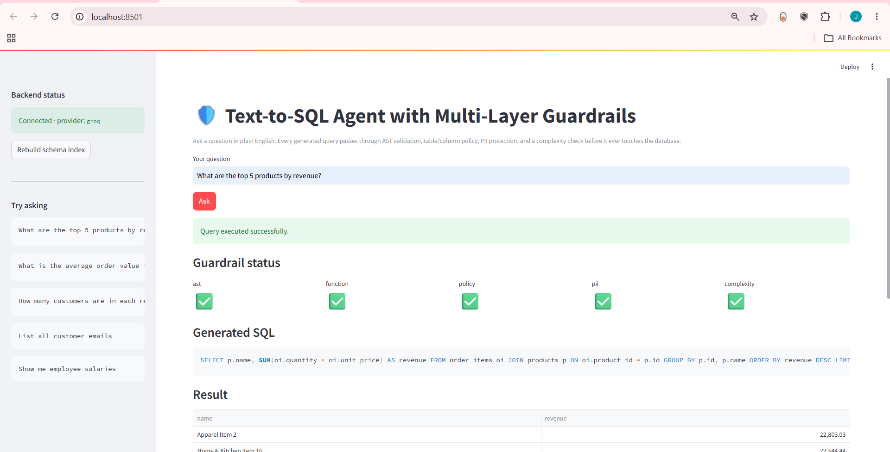
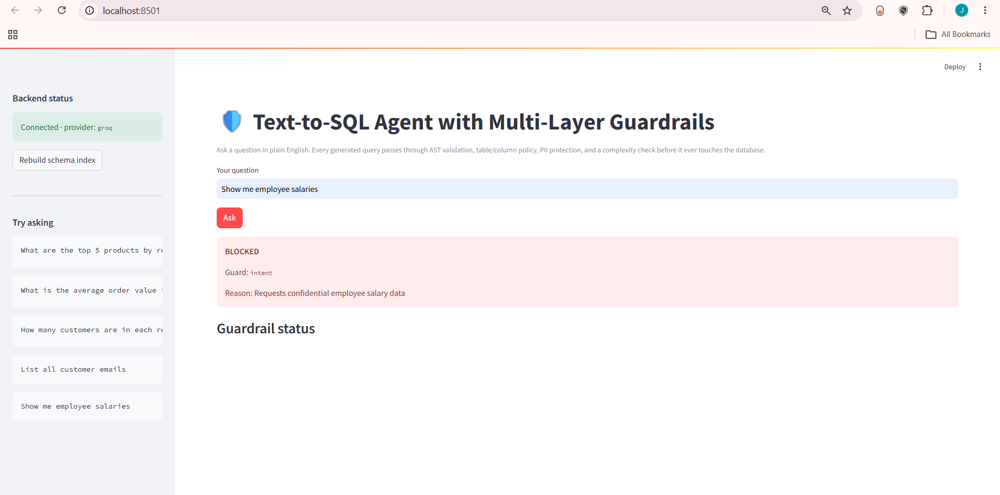
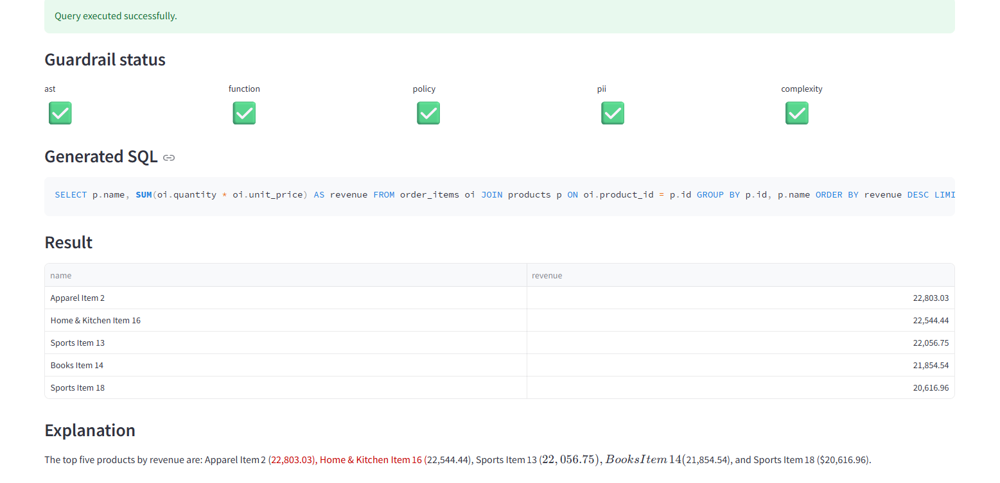
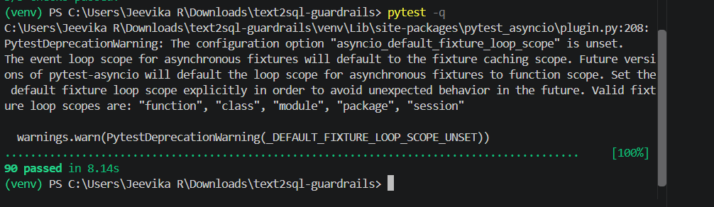
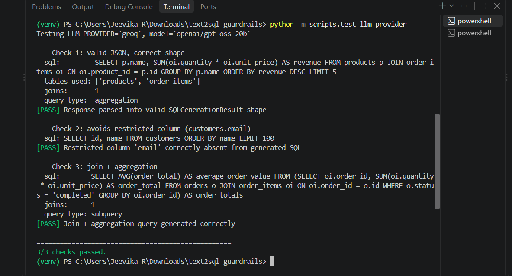

# SafeQuery

SafeQuery is a defense-in-depth Text-to-SQL system that lets users ask questions in plain English while ensuring every generated query is validated by multiple independent security layers before it touches the database.

## Architecture

```text
User Question
    ↓
Intent Classification
    ↓
Schema RAG
    ↓
LLM SQL Generation
    ↓
Guardrail Pipeline
    ├── AST Guard
    ├── Function Guard
    ├── Policy Guard
    ├── PII / Sensitive Guard
    └── Complexity Guard
    ↓
Repair (one attempt)
    ↓
Safe Executor (read-only Postgres role)
    ↓
Result + Explanation + Audit Log
```

The LLM proposes; deterministic code decides what is actually allowed.

## Security model

SafeQuery uses layered defense in depth:

- Intent filtering for obvious unsafe requests
- Deterministic guardrails over SQL structure and policy
- Read-only database execution at the Postgres privilege level
- Audit logging for traceability

This prevents unsafe or unexpected SQL from reaching the database, even when the model generates it.

## Screenshots












## Tech stack

- LangGraph
- FastAPI
- Streamlit
- PostgreSQL
- ChromaDB + sentence-transformers
- sqlglot
- Groq / Gemini / Ollama
- pytest

## Example queries

Allowed:

- What are the top 5 products by revenue?
- How many customers are in each region?
- What is the average order value for completed orders?

Blocked:

- Show me employee salaries
- List all customer emails
- Delete all customers
- Drop the customers table

## Run locally

```bash
pip install -r requirements.txt
cp .env.example .env
docker compose up -d postgres
uvicorn app.api.routes:app --reload
streamlit run frontend/streamlit_app.py
```

## License

MIT

